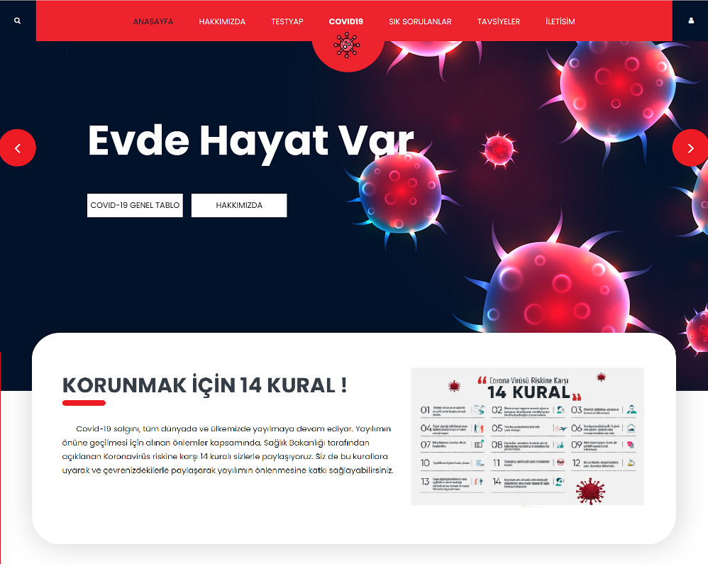
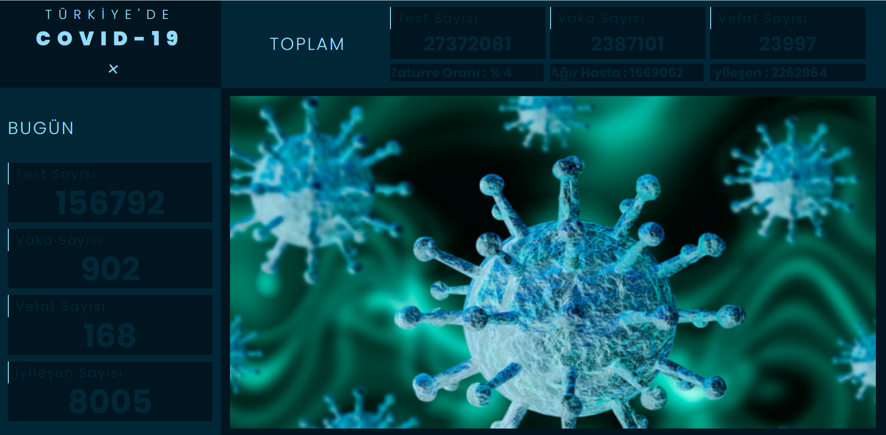
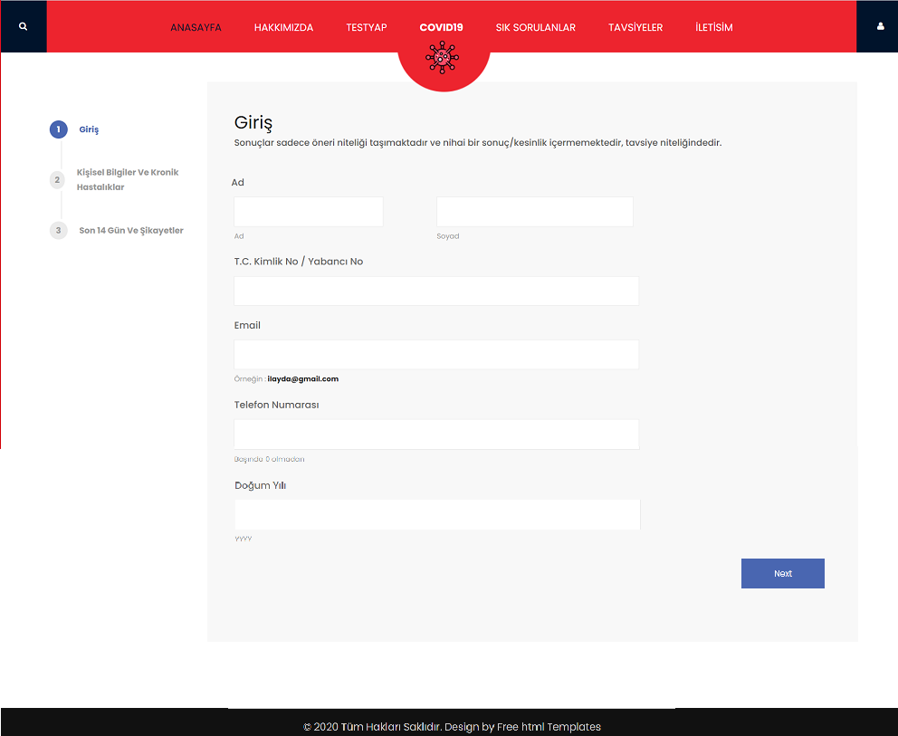
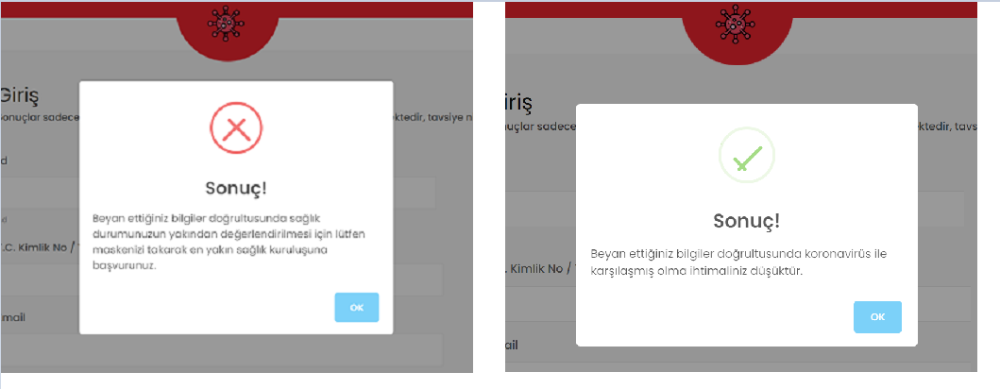
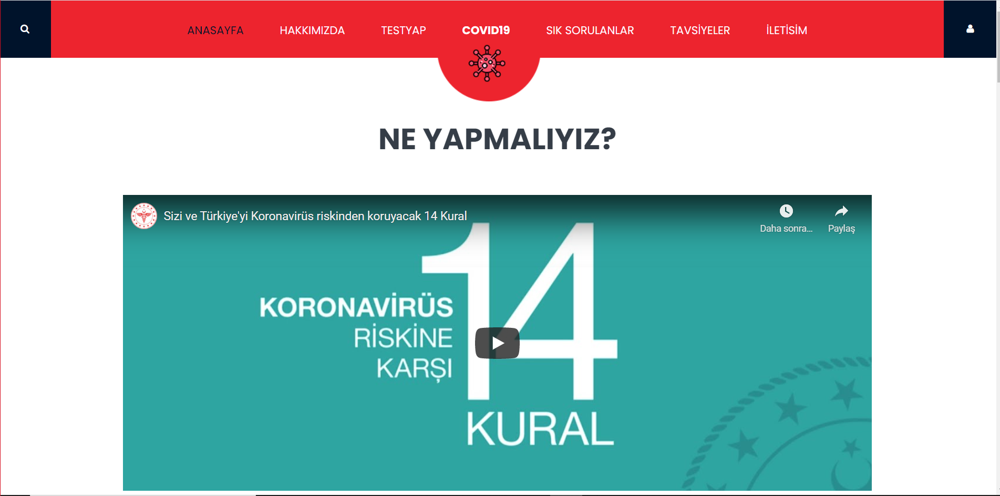
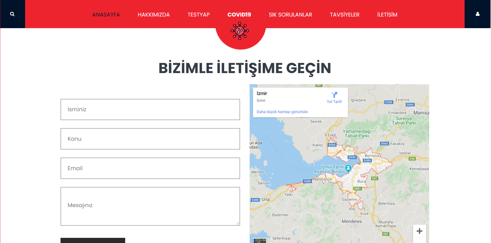
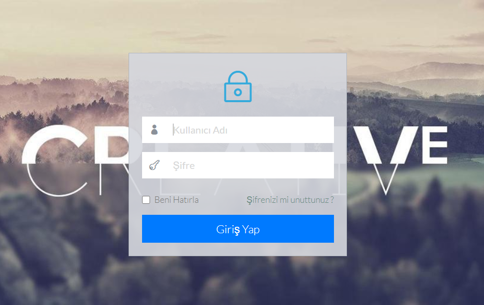
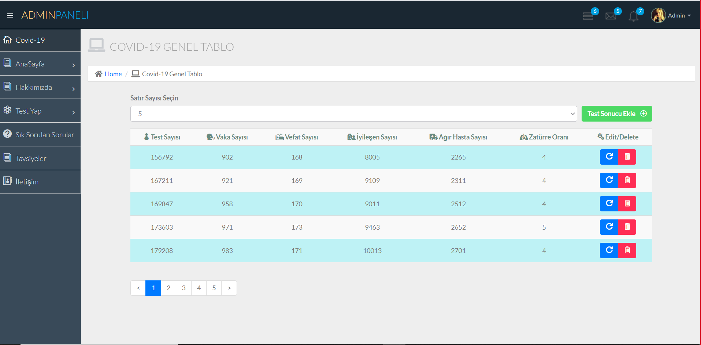
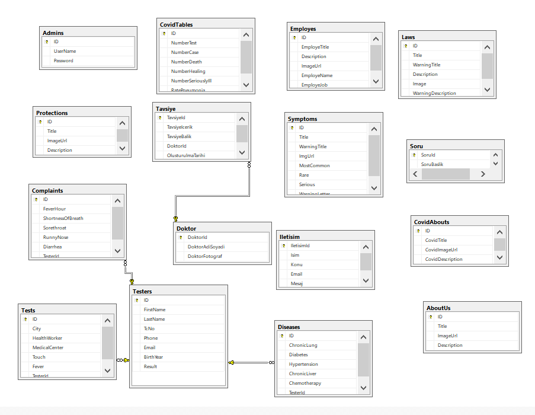

# .Net-Framework-MVC-Covid-Bilgilendirme-Web-Sitesi

</img>

 Covid-19 hakkında bilinmesi gereken genel bilgileri, Türkiye genel covid-19 tablosunu, uyulması gereken kuralları, doktor tavsiyelerini kullanıcıya sunan aynı zamanda kullanıcıların online olarak Covid - 19 test yapmasına olanak sağlayan ve sonuca göre kullanıcıyı yönlendiren bir web sitesidir. 

<h3> <strong> Covid19 Türkiye Genel Tablo </strong> </h3>
</img>

<h3> <strong> Hakkımızda Sayfası </strong> </h3>
</img>

<h3> <strong> Test Yap </strong> </h3>
</img>

<h3> <strong> Test Sonucları </strong> </h3>
</img>

<h3> <strong> Sık Sorulan Sorular </strong> </h3>
</img>

<h3> <strong> Tavsiyeler </strong> </h3>
</img>

<h3> <strong> İletişim </strong> </h3>
</img>

<h3> <strong> Admin Login </strong> </h3>
</img>

<h3> <strong> Admin  </strong> </h3>
</img>

<h3> <strong> Veritabanı Diyagramı  </strong> </h3>
</img>

  
